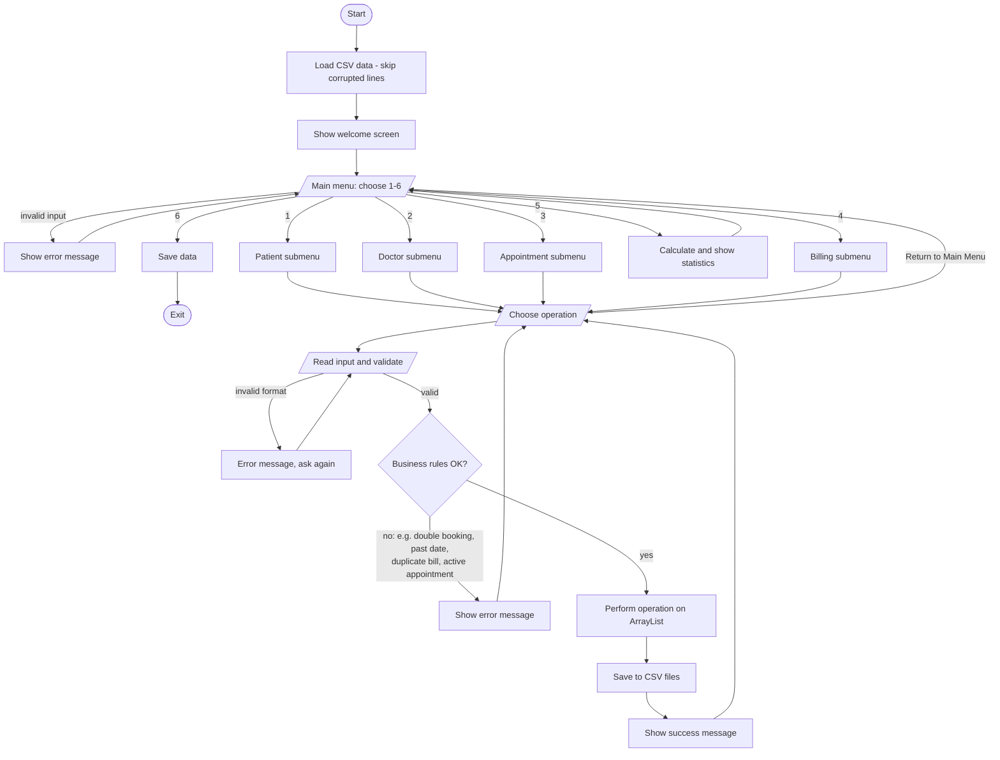
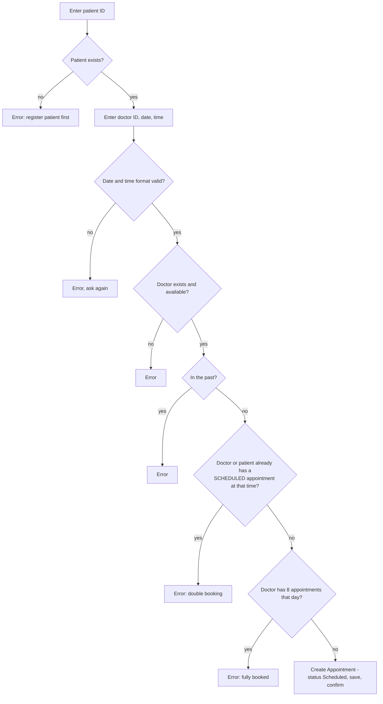

# Application Flowchart

```mermaid
flowchart TD
    A([Start]) --> B[Load CSV data - skip corrupted lines]
    B --> C[Show welcome screen]
    C --> D[/Main menu: choose 1-6/]
    D -->|invalid input| E[Show error message] --> D
    D -->|1| P[Patient submenu]
    D -->|2| Q[Doctor submenu]
    D -->|3| R[Appointment submenu]
    D -->|4| S[Billing submenu]
    D -->|5| T[Calculate and show statistics] --> D
    D -->|6| X[Save data] --> Z([Exit])

    P --> P1[/Choose operation/]
    Q --> P1
    R --> P1
    S --> P1
    P1 --> V[/Read input and validate/]
    V -->|invalid format| V1[Error message, ask again] --> V
    V -->|valid| BR{Business rules OK?}
    BR -->|no: e.g. double booking, past date,<br/>duplicate bill, active appointment| ER[Show error message] --> P1
    BR -->|yes| OK[Perform operation on ArrayList]
    OK --> SV[Save to CSV files] --> MSG[Show success message] --> P1
    P1 -->|Return to Main Menu| D
```

## Appointment booking detail

```mermaid
flowchart TD
    A[Enter patient ID] --> B{Patient exists?}
    B -->|no| E1[Error: register patient first]
    B -->|yes| C[Enter doctor ID, date, time]
    C --> D{Date and time format valid?}
    D -->|no| E2[Error, ask again]
    D -->|yes| F{Doctor exists and available?}
    F -->|no| E3[Error]
    F -->|yes| G{In the past?}
    G -->|yes| E4[Error]
    G -->|no| H{Doctor or patient already has a<br/>SCHEDULED appointment at that time?}
    H -->|yes| E5[Error: double booking]
    H -->|no| I{Doctor has 8 appointments that day?}
    I -->|yes| E6[Error: fully booked]
    I -->|no| J[Create Appointment - status Scheduled, save, confirm]
```
